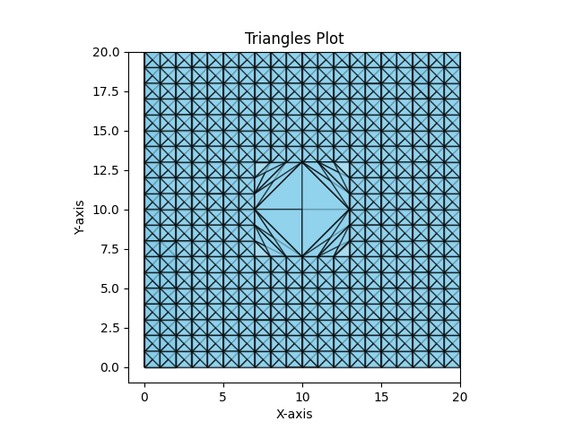

# StructuralAnalysisCUDA

## OpenMP + MPI + CUDA Installation in Visual Studio 2022: 

Create a console C++ program in visual studio 

### Add CUDA:
a.	Right click on project name > Build Dependencies > Select CUDA
b.	Open Project Properties > Linker > Input > Additional Dependencies: `cudart_static.lib`
### Add OMP:
a.	Open Project Properties > C/C++ > Language > Open MP Support: Yes
### Add MPI:
a.	Open Project Properties > VC++ Directories > Include Directories: MPI installation folder / include 
b.	Open Project Properties > VC++ Directories > Library Directories: MPI installation folder / Lib / x64
c.	Open Project Properties > Linker > Input > Additional Dependencies: `msmpi.lib; msmpifec.lib`

	a 
## Generating Mesh with 400 Points

## Generating Mesh with 900 Points
